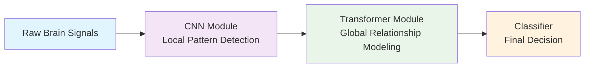

# EEG Conformer: CNNs and Transformers for Better Brain Signal Decoding

**Author:** Silvia Tulli\
**Date:** June 6th 2025


Imagine if we could combine the best of two powerful AI architectures to better understand the complex signals our brains produce. That's exactly what researchers accomplished with the EEG Conformer, a neural network that merges convolutional neural networks with transformer architectures to decode electroencephalogram (EEG) signals.

EEG signals capture the electrical activity of our brains through electrodes placed on the scalp. These signals are incredibly complex, containing both spatial information (where the activity occurs) and temporal patterns (how the activity changes over time). For brain-computer interfaces and medical applications, accurately decoding these signals is crucial but challenging.

EEG signals are like trying to listen to whispered conversations in a noisy restaurant—while wearing earplugs. The brain's electrical activity is incredibly subtle, measured in microvolts, and contaminated by everything from eye blinks to muscle movements.


### The EEG Data Landscape

```
What we're working with:
• 22 electrodes across the scalp
• 1000+ time points per second
• Multiple frequency bands (like radio stations)
• Signal strength: 10-100 microvolts (incredibly weak!)
• Contaminated by artifacts (eye blinks, muscle tension, electrical noise)
```
---

Traditional approaches using CNNs excel at capturing local features in EEG data but struggle with long-term dependencies—those important patterns that unfold over longer time periods. Meanwhile, transformer models, famous for their success in natural language processing, are excellent at capturing these long-range relationships and a growing number of researchers are starting to employ them for EEG signal processing, as we previously mentioned in our previous post: [Attention Models Application in EEG Signal Processing]().




The EEG-Conformer Architecture comprises of a three-stage pipeline:
* *CNN Module*: First, convolutional layers scan through the EEG data identifying local patterns in both time and across brain regions. Think of it as recognizing individual "words" in the brain's language.
* *Transformer Module*: Next, the transformer takes these local patterns and figures out how they relate to each other over longer time periods. It's like understanding how those "words" form meaningful "sentences" of neural activity.
* *Classifier*: Finally, a simple classifier takes all this rich information and makes the final call about what the brain signal represents.

## Convolution Module Details:
```python
# Temporal convolution: learns patterns within each brain region
temporal_conv = Conv1D(channels=22, filters=40, kernel_size=64)

# Spatial convolution: learns how brain regions interact
spatial_conv = DepthwiseConv1D(groups=40)
```

The temporal convolution is like having 40 different "detectors," each tuned to find specific patterns in the timing of brain activity. The temporal convolution takes $1 × ch × sp$ as input, i.e., channels per number of time samples, and $k$ kernels of size $(1, 25)$. The output is $k × ch × (sp-24)$.
The spatial convolution then asks: "When this pattern appears in one brain region, what happens in the others?". The spatial convolution takes as input the output of the temporal convolution $k × ch × (sp-24)$ and $k$ kernels of size $(ch, 1)$. The output is $k × 1 × (sp-24)$. 
After spatial convolution, batch normalization + ELU activation are applied. For the average pooling, the kernel size is $(1, 75)$ and the output dimensions is $k × 1 × T_{out}$, where $T_{out} = floor((sp-24-75)/15) + 1$.
Before Self-attention is used, the feature are rearranged by squeezing electrode channel dimension, transposing convolution channels with time dimension and finally getting a shape: $T_{out} × k$ (tokens × features per token).


Self-Attention:
Through self-attention, the transformer creates a dynamic map where each point in the EEG signal can evaluate its relationship with every other point, assigning importance weights based on relevance. This comprehensive cross-referencing enables the detection of subtle long-term dependencies that unfold over extended time periods.
The attention module takes $X ∈ ℝ^{m×d}$ as input. Where $m$ is the number of tokens ($T_{out}$) and $d$ is the feature dimension per token (k = 40).
For each attention head $Q_l = X W_Q^l,  K_l = X W_K^l,  V_l = X W_V^l$, where $W_Q^l, W_K^l, W_V^l ∈ ℝ^{d×(d/h)}$. Then Scaled Dot-Product Attention and Multi-Head Attention are performed (as explained in our previous post).

After self-attention, two fully-connected layers are applied (Feed-Forward Network). The self-attention computation is repeated 6 times.

Then, two fully-connected layers output an M-dimensional vector followed by Softmax are used for the final classification. Cross-entropy loss $$L = -1/N_b \sum_{i=1}^{N_b} \sum_{c=1}^M y log(ŷ)$$ is used, where $N_b$ is batch size, $M$ is the number of categories, $y$ is the ground truth label and $ŷ$ is the predicted probability.

The parameters used for training are: 
- Optimizer: Adam
- Learning rate: 0.0002
- $β₁$: 0.5
- $β₂$: 0.999


# Evaluation
The EEG Conformer was tested on the BCI Competition IV Dataset 2a—the standard for motor imagery classification (detecting when someone imagines moving their left hand vs. right hand or feet vs tongue). Kappa coefficient is used as evaluation metric: $kappa = (p_o - p_e) / (1 - p_e)$.

| Method | Accuracy | What This Means |
|--------|----------|-----------------|
| Traditional FBCSP | 69.3% | Decent, but room for improvement |
| EEGNet | 73.8% | Good CNN performance |
| ShallowConvNet | 75.7% | Previous state-of-the-art |
| **EEG Conformer** | **80.0%** | **New benchmark achieved** |

---

### What About Individual Differences?

One fascinating aspect of the results is how consistently the EEG Conformer improved performance across different people:

- **Best improvement**: Subject 1 gained 4.1% accuracy
- **Most challenging case**: Subject 2 still gained 2.7%
- **Statistical significance**: p < 0.05 across all subjects

This consistency matters because brain signals are highly individual, i.e., what works for one person might not work for another. The EEG Conformer's robust performance suggests it's learning something fundamental about how brains encode information.

---

## Making the Invisible Visible: Interpretability

Perhaps the most interesting feature of the EEG Conformer is its ability to show us which brain regions it's "paying attention to" when making decisions. The researchers developed a visualization technique called "Class Activation Topography" that projects the model's attention onto a map of the brain.

**Key findings for motor imagery tasks:**
- **Frontal regions** (areas like Fp1, F1): Important for motor planning
- **Parietal regions** (CP5, P7, P4): Critical for spatial awareness
- **Central regions** (C3, C4): The motor cortex itself

This validates that the model is learning meaningful patterns that align with our neuroscientific understanding of how the brain works.

The fact that the model's attention maps correspond to known brain anatomy gives us confidence that it's not just memorizing data but actually learning the underlying neural mechanisms. This interpretability is crucial for medical applications where understanding *why* a decision was made is as important as the decision itself.


*Raw EEG topography averaged over all trials of each subject, Class Activation Mapping (CAM) of the Transformer module on the input EEG, Class Activation Topography (CAT) they designed to show CAM-weighted EEG.*


---

## Implementation: Getting Your Hands Dirty

The beauty of the EEG Conformer is that the researchers made everything open source. You can find the code linked below.

### Preprocessing: The Foundation Matters

Before feeding data to the model, proper preprocessing is necessary:

1. **Bandpass filtering**: Remove electrical noise and irrelevant frequencies (4-38 Hz typically)
2. **Normalization**: Standardize signal amplitudes across channels
3. **Artifact removal**: Clean out eye blinks, muscle tension, and other contamination

The model is relatively forgiving, but good preprocessing can make the difference between mediocre and excellent results.
The raw EEG input has dimensions channels × number of time samples. A Z-score standardization is used $x_o = (x_i - μ) / √σ²$. where: $x_i$ is band-pass filtered data, $x_o$ is the standardized output $\mu$ is the mean calculated from training data and $σ²$ is the variance calculated from training data.

---

## Challenges and Future Directions

### Current Limitations

No method is perfect, and the EEG Conformer has its challenges:

1. **Individual variability**: While consistent, performance still varies between people
2. **Computational cost**: More expensive than simple CNNs (though reasonable)
3. **Parameter sensitivity**: Requires careful tuning for optimal performance
4. **Transfer learning**: Models trained on one person don't automatically work well for others

---

## Conclusion

The EEG Conformer appears to be a promising approach, achieving something neither CNNs nor Transformers could accomplish alone. However, several challenges remain for practical implementation: acquiring sufficient labeled data for training, establishing robust preprocessing protocols for utilizing this architecture, and adapting the model to real-world scenarios where users have **limited exposure to stimuli with few repetitions**. Perhaps most critically, at HABS we face the challenge of developing **experimental protocols that are more ecologically valid—closer to natural**, everyday conditions, while still maintaining the controlled conditions necessary to achieve results comparable to those reported in state-of-the-art papers using ideal laboratory datasets.

---

## Resources and Further Reading

- **📄 Original Paper**: [IEEE Transactions on Neural Systems and Rehabilitation Engineering](https://ieeexplore.ieee.org/document/9991178)
- **💻 Open Source Code**: [GitHub Repository](https://github.com/eeyhsong/EEG-Conformer)
- **🛠️ Framework Integration**: Available in [Braindecode](https://braindecode.org/)
- **📊 Datasets**: [BCI Competition IV](https://www.bbci.de/competition/iv/), [SEED](https://bcmi.sjtu.edu.cn/home/seed/), [DEAP](https://www.eecs.qmul.ac.uk/mmv/datasets/deap/)

### Citation
```bibtex
@article{song2023eeg,
    title={EEG Conformer: Convolutional Transformer for EEG Decoding and Visualization},
    author={Song, Yonghao and Zheng, Qingqing and Liu, Bingchuan and Gao, Xiaorong},
    journal={IEEE Transactions on Neural Systems and Rehabilitation Engineering},
    volume={31},
    pages={710--719},
    year={2023},
    doi={10.1109/TNSRE.2022.3230250}
}
```
